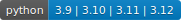

# Commit Assistant
[](https://codecov.io/gh/OrarioGit/Commit-Assistant)


Commit Assistant 是一個基於 AI 的 Git commit 訊息生成工具，它能夠：
- 自動分析你的程式碼變更
- 使用 Google Gemini AI 生成清晰、規範的 commit 訊息
- 作為 Git hook 自動運行，提升開發效率

## 特點

- 🤖 利用 AI 智能分析程式碼變更
- 📝 生成結構化的 commit 訊息
- 🔄 無縫整合到 Git 工作流程
- 🌐 支援多個 Git 專案共用配置

## 安裝

### 1. 安裝套件

```bash
# 從 GitHub 安裝
pip install git+https://github.com/OrarioGit/Commit-Assistant.git

# 或clone後本地安裝
git clone https://github.com/OrarioGit/Commit-Assistant.git
cd commit-assistant
pip install -e .
```

### 2. 設定 Google Gemini API 金鑰

1. 前往 [取得 Gemini API 金鑰](https://ai.google.dev/gemini-api/docs/api-key) 註冊並獲取 API 金鑰
2. 運行以下命令設定金鑰：
```bash
commit-assistant config setup
```

### 3. 設定 Git Hook

在你的 Git 專案中運行：
```bash
cd your-repository-path
commit-assistant install
```

## 使用方法

### 自動模式（推薦）

安裝完成後，當你執行 `git commit` 時，Commit Assistant 會自動運行並生成 commit 訊息。

### 手動模式

你也可以手動運行命令：
```bash
commit-assistant commit
```

### 配置管理

查看當前配置：
```bash
commit-assistant config show
```

清除配置：
```bash
commit-assistant config clear
```

## 更新管理

Commit Assistant 提供了方便的更新機制，可以輕鬆更新單一或多個專案的相關設定。

### 更新單一專案

在專案目錄下執行：
```bash
commit-assistant update
```

或指定特定專案路徑：
```bash
commit-assistant update --repo-path /path/to/your/repo
```

這個指令會：
- 更新專案的 Git hook 設定
- 更新相關配置文件
- 自動記錄安裝信息

### 批量更新所有專案

更新所有曾經安裝過的專案：
```bash
commit-assistant update --all-repo
```

這個指令會：
- 自動掃描所有已安裝的專案
- 依序更新每個專案的設定
- 提供更新進度和結果報告
- 自動跳過不存在的專案路徑

如果更新過程中某個專案發生錯誤，程式會：
- 顯示錯誤信息
- 繼續處理其他專案

## 支援的風格

- Conventional
  
- Emoji
  
- Angular
  
- Custom (個人定義給自己內部專案使用的)
  

## 摘要功能
可將指定區間的 commit 訊息進行簡短摘要，AI 產生完摘要後除了會顯示於 terminal 外，也會將摘要內容自動複製到剪貼簿中
```bash
commit-assistant summary --start-from "commit 起始日期(YYYY-mm-dd HH:MM:SS 或 YYYY-mm-dd)" --end-to "commit 結束日期(YYYY-mm-dd HH:MM:SS 或 YYYY-mm-dd)"
```

## 共同開發
### Git 工作流程
為保持提交歷史的整潔，請使用 rebase 方式進行更新：
```bash
# 更新專案時使用 rebase
git pull --rebase origin main
```

在開始開發之前，請依序完成以下設定：
### 1. 安裝開發相依套件
```bash
# Clone 專案
git clone https://github.com/OrarioGit/Commit-Assistant.git
cd commit-assistant

# 安裝開發相依套件
pip install -e ".[dev]"
```

### 2. 安裝 pre-commit hooks
```bash
pre-commit install
```

### 3. 程式碼風格與檢查
本專案使用 ruff 作為主要的程式碼 linter：

```bash
# 執行程式碼檢查
ruff check .

# 自動修正格式問題
ruff format .
```

建議在你的開發環境中設定編輯器支援 ruff，這樣可以即時看到程式碼問題：

- VS Code：安裝 "Ruff" 擴充套件
- PyCharm：啟用 Ruff 整合
- 其他編輯器：[參考 Ruff 官方文件](https://github.com/astral-sh/ruff)

### 4. 關於產生 pyproject.toml
在本專案中如果有相關的更動比如**版本更新**、**依賴更新**等
可先更改`core/project_config.py`裡面的設定
並執行以下指令

```bash
python -m commit_assistant.scripts.build_pyproject
```

該指令可根據變更產生出統一規範的pyproject.toml檔
**注意!** 執行前需先使用`pip install -e ".[dev]"`進行安裝

## 常見問題

**Q: 如何更新 API 金鑰？**  
A: 再次運行 `commit-assistant config setup` 即可更新

**Q: 如何在特定專案停用自動生成？**  
A: 編輯 `.commit-assistant-config` 檔案，設定 `ENABLE_COMMIT_ASSISTANT=false`


## 貢獻

歡迎提出任何改進建議和 Pull Requests！

## 授權

本專案採用 Apache License 2.0 授權，詳見 [LICENSE](LICENSE) 檔案。