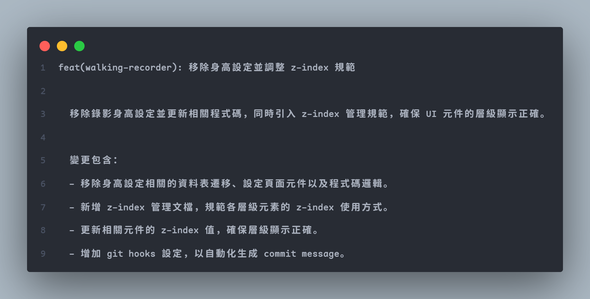
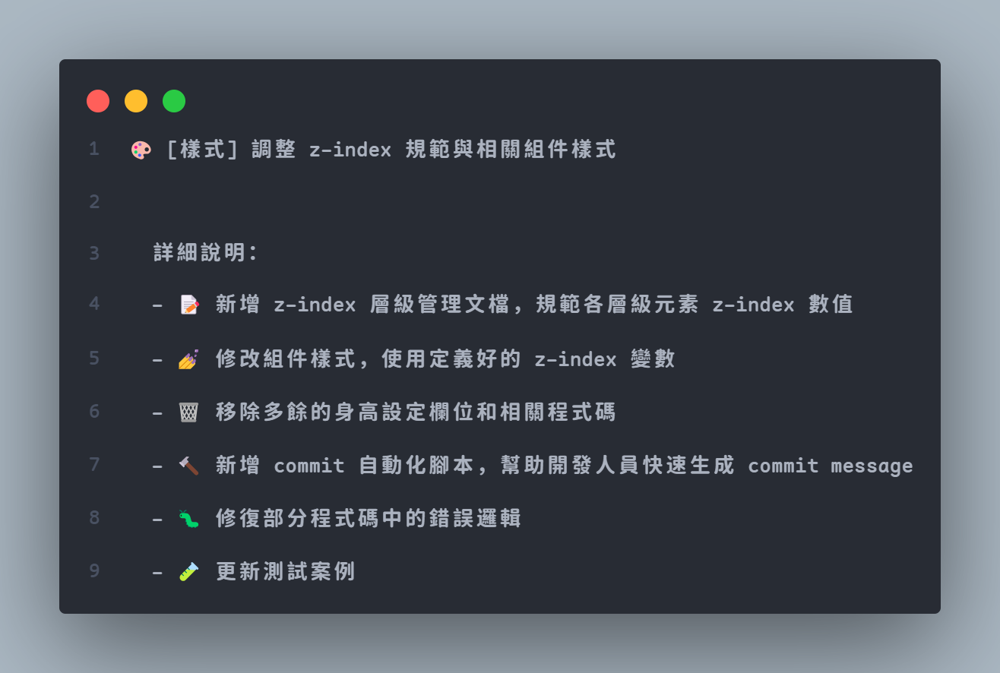
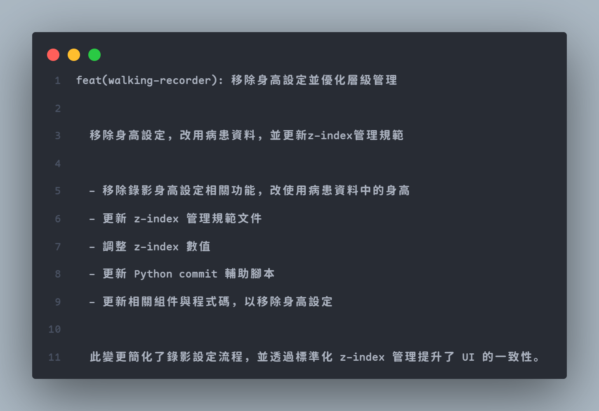
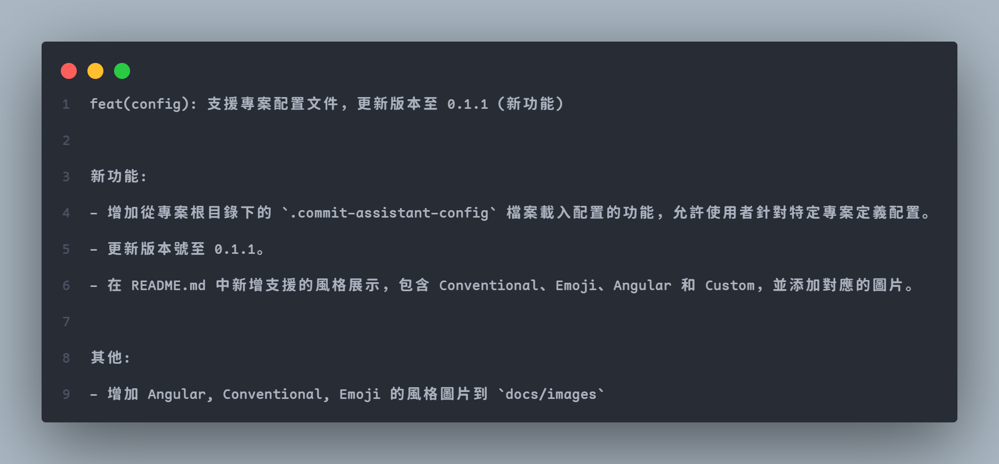

# Commit Assistant

Commit Assistant 是一個基於 AI 的 Git commit 訊息生成工具，它能夠：
- 自動分析你的程式碼變更
- 使用 Google Gemini AI 生成清晰、規範的 commit 訊息
- 作為 Git hook 自動運行，提升開發效率

## 特點

- 🤖 利用 AI 智能分析程式碼變更
- 📝 生成結構化的 commit 訊息
- 🔄 無縫整合到 Git 工作流程
- 🌐 支援多個 Git 專案共用配置

## 安裝

### 1. 安裝套件

```bash
# 從 GitHub 安裝
pip install git+https://github.com/OrarioGit/Commit-Assistant.git

# 或clone後本地安裝
git clone https://github.com/OrarioGit/Commit-Assistant.git
cd commit-assistant
pip install -e .
```

### 2. 設定 Google Gemini API 金鑰

1. 前往 [取得 Gemini API 金鑰](https://ai.google.dev/gemini-api/docs/api-key) 註冊並獲取 API 金鑰
2. 運行以下命令設定金鑰：
```bash
commit-assistant config setup
```

### 3. 設定 Git Hook

在你的 Git 專案中運行：
```bash
cd your-repository-path
commit-assistant install
```

## 使用方法

### 自動模式（推薦）

安裝完成後，當你執行 `git commit` 時，Commit Assistant 會自動運行並生成 commit 訊息。

### 手動模式

你也可以手動運行命令：
```bash
commit-assistant commit
```

### 配置管理

查看當前配置：
```bash
commit-assistant config show
```

清除配置：
```bash
commit-assistant config clear
```

## 支援的風格

- Conventional
  
- Emoji
  
- Angular
  
- Custom (個人定義給自己內部專案使用的)
  

## 自定義風格
支援從本地檔案載入或者自行提供 prompt 字串

從檔案載入：
此方式將會使用檔案檔名作為 commit 風格名稱
```bash
commit-assistant style create --path "<prompt txt 檔案路徑>"
```

自行提供 Prompt：
```bash
commit-assistant style create --prompt "prompt 內容" --style-name "風格名稱"
```

列出當前使用中的 style
```bash
commit-assistant style list
```

移除 style
```bash
commit-assistant style remove --style-name "風格名稱"
```

## 常見問題

**Q: 如何更新 API 金鑰？**  
A: 再次運行 `commit-assistant config setup` 即可更新

**Q: 如何在特定專案停用自動生成？**  
A: 編輯 `.commit-assistant-config` 檔案，設定 `ENABLE_COMMIT_ASSISTANT=false`


## 貢獻

歡迎提出任何改進建議和 Pull Requests！

## 授權

本專案採用 Apache License 2.0 授權，詳見 [LICENSE](LICENSE) 檔案。