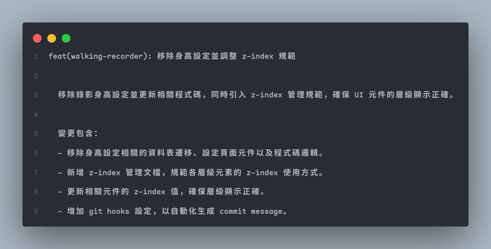
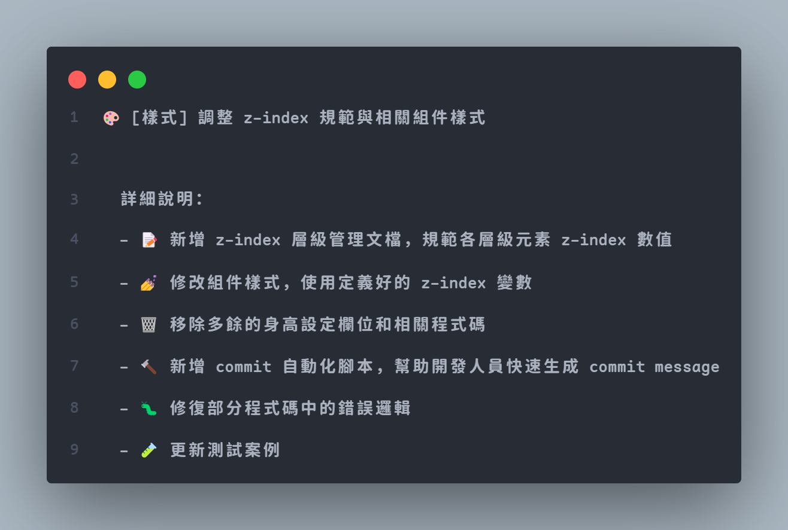
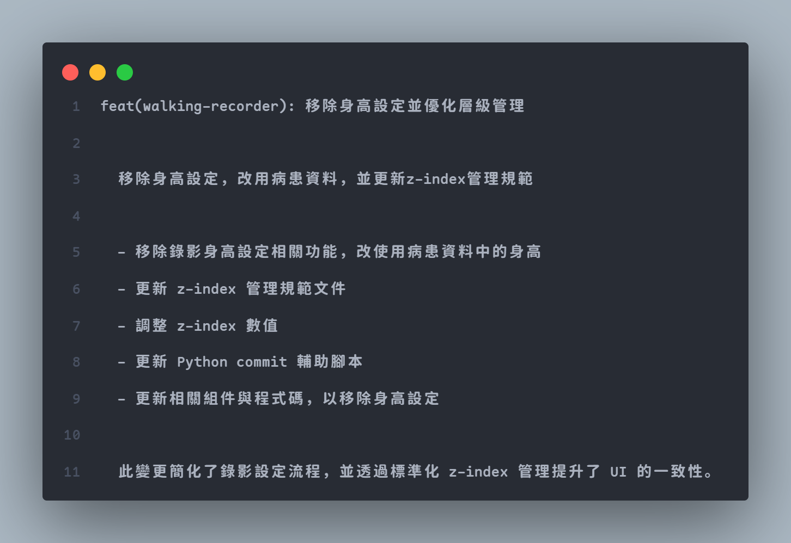
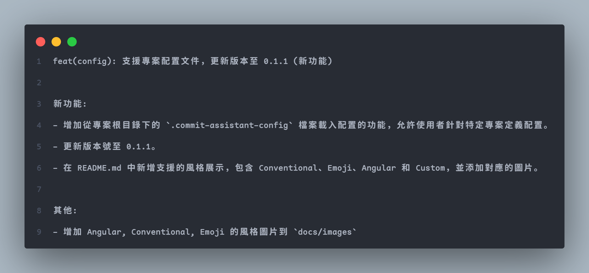

# Commit Assistant

[](https://codecov.io/gh/OrarioGit/Commit-Assistant)


Commit Assistant 是一個基於 AI 的 Git commit 訊息生成工具，它能夠：

- 自動分析你的程式碼變更
- 使用 Google Gemini AI 生成清晰、規範的 commit 訊息
- 作為 Git hook 自動運行，提升開發效率

## 目錄

1. [特點](#特點)
2. [安裝與設定](#安裝)
   - [安裝套件](#1-安裝套件)
   - [更新套件](#2-更新套件)
   - [設定 API 金鑰](#3-設定-Google-Gemini-API-金鑰)
   - [設定 Git Hook](#4-設定-Git-Hook)
3. [使用方法](#使用方法)
   - [指令說明](#指令說明)
   - [自動模式](#自動模式（推薦）)
   - [手動模式](#手動模式)
   - [配置管理](#配置管理)
4. [更新管理](#更新管理)
   - [更新單一專案](#更新單一專案)
   - [批量更新](#批量更新所有專案)
5. [Commit 風格管理](#Commit-風格管理)
   - [風格層級](#風格的層級)
   - [系統內建風格](#系統內建的風格範例)
   - [風格操作指令](#列出當前專案可使用的風格)
   - [使用建議](#使用建議)
6. [摘要功能](#摘要功能)
7. [共同開發此專案](#共同開發此專案)
   - [開發環境設定](#1-安裝開發相依套件)
   - [程式碼規範](#3-程式碼風格與檢查)
8. [常見問題](#常見問題)
9. [貢獻與授權](#貢獻)

## 特點

- 🤖 利用 AI 智能分析程式碼變更
- 📝 生成結構化的 commit 訊息
- 🔄 無縫整合到 Git 工作流程
- 🌐 支援多個 Git 專案共用配置

## 安裝

### 1. 安裝套件

```bash
# 從 GitHub 安裝
pip install git+https://github.com/OrarioGit/Commit-Assistant.git

# 或clone後本地安裝
git clone https://github.com/OrarioGit/Commit-Assistant.git
cd commit-assistant
pip install -e .
```

### 2. 更新套件

```bash
# 直接更新至最新版本
pip install git+https://github.com/OrarioGit/Commit-Assistant.git -U

# 或在本地專案目錄更新
pip install -e . -U
```

### 3. 設定 Google Gemini API 金鑰

1. 前往 [取得 Gemini API 金鑰](https://ai.google.dev/gemini-api/docs/api-key) 註冊並獲取 API 金鑰
2. 運行以下命令設定金鑰：

```bash
commit-assistant config setup
```

### 4. 設定 Git Hook

在你的 Git 專案中運行：

```bash
cd your-repository-path
commit-assistant install
```

這個指令會：

- 安裝 Git hook（`prepare-commit-msg`）
- 在 `.commit-assistant/` 目錄下建立 `.commit-assistant-config.example` 供團隊參考
- 自動將 `.commit-assistant-config` 加入 `.gitignore`（個人設定不會被提交）

接著，將 example 複製為個人設定檔（hook 偵測到此檔案才會啟動）：

```bash
cp .commit-assistant/.commit-assistant-config.example .commit-assistant/.commit-assistant-config
```

> **設計說明**
> - `.commit-assistant-config.example`：提交至版本控制，供整個團隊參考設定格式
> - `.commit-assistant-config`：個人設定，已加入 `.gitignore`，不會被提交

## 使用方法

### 指令說明

Commit Assistant 提供兩種方式呼叫指令：

- `commit-assistant`: 完整指令
- `cmt-a`: 簡短別名，功能完全相同

以下說明中的指令皆可使用上述兩種方式執行，例如：

```bash
commit-assistant commit

# 或
cmt-a commit
```

### 自動模式（推薦）

安裝完成後，當你執行 `git commit` 時，Commit Assistant 會自動運行並生成 commit 訊息。

### 手動模式

你也可以手動運行命令：

```bash
commit-assistant commit
```

### 配置管理

查看當前配置：

```bash
commit-assistant config show
```

清除配置：

```bash
commit-assistant config clear
```

## 更新管理

Commit Assistant 提供了方便的更新機制，可以輕鬆更新單一或多個專案的相關設定。

### 更新單一專案

在專案目錄下執行：

```bash
commit-assistant update
```

或指定特定專案路徑：

```bash
commit-assistant update --repo-path /path/to/your/repo
```

這個指令會：

- 更新專案的 Git hook 設定
- 更新 `.commit-assistant-config.example` 至最新版本（**不會修改**你的個人 `.commit-assistant-config`）
- 自動記錄安裝信息

### 批量更新所有專案

更新所有曾經安裝過的專案：

```bash
commit-assistant update --all-repo
```

這個指令會：

- 自動掃描所有已安裝的專案
- 依序更新每個專案的設定
- 提供更新進度和結果報告
- 自動跳過不存在的專案路徑

如果更新過程中某個專案發生錯誤，程式會：

- 顯示錯誤信息
- 繼續處理其他專案

## Commit 風格管理

Commit Assistant 支援多種提交訊息風格，並允許使用者自訂專屬的風格模板。

### 風格的層級

Commit Assistant 提供三種層級的風格管理：

1. **系統內建**
   - 套件提供的預設風格（conventional, emoji, angular, custom）
   - 無法修改或刪除
   - 適用於所有專案

2. **全域自訂**（Global）
   - 可以在不同專案間共用
   - 適合團隊或個人常用的自訂風格
   - 只有當前使用者可以使用

3. **專案自訂**（Project）
   - 存放在專案目錄 `./your-repo/.commit-assistant/style/`
   - 僅對當前專案有效
   - 會被包含在版本控制中
   - 適合專案特定的提交規範
   - 團隊所有成員都可以使用

如果有重名
系統使用優先順序：專案自訂 > 全域自訂 > 系統內建

### 系統內建的風格範例

- Conventional
  
- Emoji
  
- Angular
  
- Custom (個人定義給自己內部專案使用的)
  

### 列出當前專案可使用的風格

```bash
cd your-repository-path
commit-assistant style list
```

此指令會顯示所有層級的可用風格和其描述。

### 在專案內使用特定風格

執行完後，會幫您把設定的風格寫入我們的 config 檔案中
注意：如果有重名的檔案
系統採用順序：專案自訂 > 全域自訂 > 系統內建

```bash
cd your-repository-path
commit-assistant style use <風格名稱>
```

### 匯出風格 template

第一次使用不知道該匯入怎麼樣的格式嗎，使用 template 照著改就行~

```bash
# 匯出模板到當前目錄
commit-assistant style template

# 或者，您有自己心儀的路徑
commit-assistant style template -o .\some_secret_path
```

### template 範例

```yaml
description: "風格描述"
prompt: |
  請根據以下的代碼變更生成符合規範的 commit message。

  變更文件:
  {changed_files}
  變更內容:
  {diff_content}

  [您的格式規範...]

  要求：
  1. [您的要求 1]
  2. [您的要求 2]
```

### 匯入風格

```bash
# 為當前專案匯入風格（會被版本控制）
# 匯入後會加入一個my-style的風格
commit-assistant style add my-style.yaml

# 當然您也可以取一個您喜歡的名字
commit-assistant style add my-style.yaml -n cool-style

# 匯入為全域風格（可在不同專案中使用）
commit-assistant style add --global my-style.yaml
```

### 移除風格

累了，毀滅吧，我不要這個風格了

```bash
commit-assistant style remove <風格名稱>

# 移除全域風格
commit-assistant style remove <風格名稱> -g
```

### 使用建議

1. 選擇全域或專案風格？
    - 如果是團隊共用的風格，建議使用專案風格，更好與團隊共用
    - 如果是個人偏好的風格，建議使用全域風格，使用全域優先使用自己的個人風格
    - 如果需要在版本控制中追蹤風格的變更，使用專案風格，畢竟團隊的統一也很重要
2. 風格管理最佳實踐
    - 在 `.gitignore` 中排除全域風格目錄
    - 為風格檔案提供清楚的描述
    - 在團隊中統一使用專案風格

## 摘要功能

可將指定區間的 commit 訊息進行簡短摘要，AI 產生完摘要後除了會顯示於 terminal 外，也會將摘要內容自動複製到剪貼簿中

```bash
commit-assistant summary --start-from "commit 起始日期(YYYY-mm-dd HH:MM:SS 或 YYYY-mm-dd)" --end-to "commit 結束日期(YYYY-mm-dd HH:MM:SS 或 YYYY-mm-dd)"
```

## 共同開發此專案

### Git 工作流程

為保持提交歷史的整潔，請使用 rebase 方式進行更新：

```bash
# 更新專案時使用 rebase
git pull --rebase origin main
```

在開始開發之前，請依序完成以下設定：

### 1. 安裝開發相依套件

```bash
# Clone 專案
git clone https://github.com/OrarioGit/Commit-Assistant.git
cd commit-assistant

# 可依需求建立虛擬環境
# uv venv

# 安裝開發相依套件
pip install -e ".[dev]"
```

### 2. 安裝 pre-commit hooks

```bash
# 這會在您 commit 前做些基本檢查
pre-commit install
```

### 3. 程式碼風格與檢查

本專案使用 ruff 作為主要的程式碼 linter：

```bash
# 執行程式碼檢查
ruff check .

# 自動修正格式問題
ruff format .
```

建議在你的開發環境中設定編輯器支援 ruff，這樣可以即時看到程式碼問題：

- VS Code：安裝 "Ruff" 擴充套件
- PyCharm：啟用 Ruff 整合
- 其他編輯器：[參考 Ruff 官方文件](https://github.com/astral-sh/ruff)

### 4. 關於產生 pyproject.toml

在本專案中如果有相關的更動比如**版本更新**、**依賴更新**等
可先更改`core/project_config.py`裡面的設定
並執行以下指令

```bash
python -m commit_assistant.scripts.build_pyproject
```

該指令可根據變更產生出統一規範的 pyproject.toml 檔
**注意！** 執行前需先使用`pip install -e ".[dev]"`進行安裝

## 常見問題

**Q: 如何更新 API 金鑰？**
A: 再次運行 `commit-assistant config setup` 即可更新

**Q: 如何在特定專案停用自動生成？**
A: 編輯 `.commit-assistant/.commit-assistant-config`，設定 `ENABLE_COMMIT_ASSISTANT=false`。若尚未建立個人設定檔，請先執行 `cp .commit-assistant/.commit-assistant-config.example .commit-assistant/.commit-assistant-config`

## 貢獻

歡迎提出任何改進建議和 Pull Requests！

## 授權

本專案採用 Apache License 2.0 授權，詳見 [LICENSE](LICENSE) 檔案。
